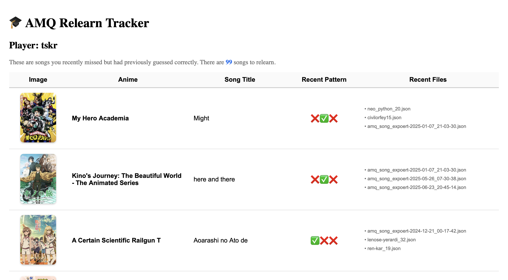

## App Name: AMQ Relearn Tracker

## Problem Statement: I play this game called Anime Music Quiz(AMQ) where I guess anime songs. After I learn a song and get it once, I often forget it and not get it next time. 

## Solution
This program helps me determine the songs I need to relearn, displayed in an easy-to-read fashion.

## API Used
- **API Name**: JIKAN api
- **API Documentation**: https://docs.api.jikan.moe
- **How it's used**: I fetched the anime image/cover. I did this because a visual representation could help me immediately recognize the anime. Also, it is visually appealing compared to a simple display with only text.

## Features
- Image
- Anime name
- Song title
- Recent pattern
- Recent files

## Setup Instructions
1. Clone this repository
2. Run `npm install`
3. [Any API key setup if needed] -- None
4. Run `npm start`
5. Open [http://localhost:3000](http://localhost:3000)

## AI Assistance
I used ChatGPT to help with:
- [Specific thing 1]: I learned the importance of async. Async lets my loadData() run in the background while the rest of the app keeps working. 
- [Specific thing 2]: I didn't really modify code using human input--the few things I did modify were colors and text that are displayed. I mostly took what GPT wrote and asked it questions, to which GPT responded with new code. I reiterated this process a lot of times. The things I did modify exist in this section:

```jsx
return (
  <div style={{ padding: "20px" }}>
    <h1>🎓 AMQ Relearn Tracker</h1>
    <h2>Player: {player}</h2>
    <p style={{ color: "#666", fontSize: "16px" }}>
      These are songs you recently missed but had previously guessed correctly.{" "}
      There are{" "}
      <span style={{ color: "#0070f3", fontWeight: "bold" }}>
        {relearn_songs.length}
      </span>{" "}
      songs to relearn.
    </p>
  </div>
);

- [Specific thing 3]: GPT was helpful in coming up with technical solutions I didn't know how to implement. For example, it helped me with making the table look evenly distributed(columns are evenly distributed and not skewed). It also helped me fetch images from JIKAN api. 

## Screenshots


## Future Improvements
With more time, I would like to improve the python backend. Currently, I search for the most 3 recent attempts. However, I might want to expand that to 5 or shorten it to 2, depending on the player. I might also want to visually represent how confident the player is for each anime using a heat map/chart--grouping by the anime title, we search for all songs and guesses and tally them. A chart showing the most confident anime would be pretty nice, even though it doesn't specifically tailor to learning. 
